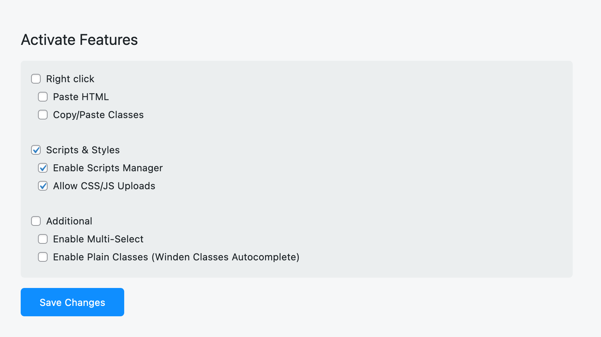
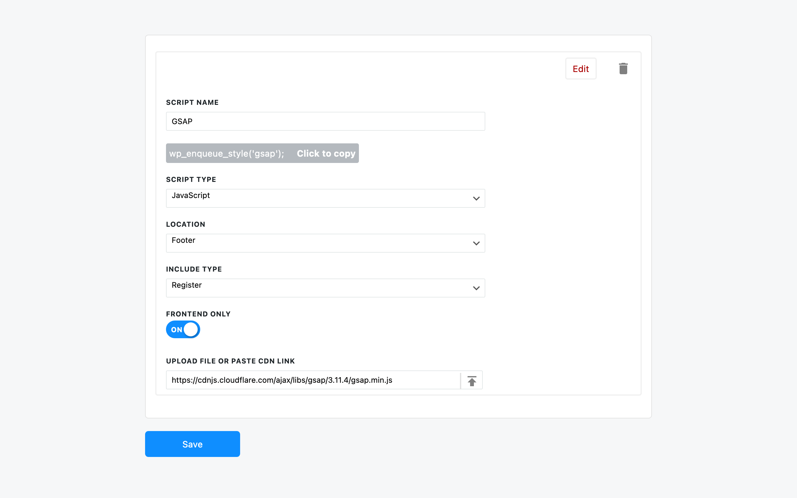

## Enable the feature

This feature is disabled by the default.
Check Emable Scripts Manger and save changes.

## Enable files upload

For self-hosting scripts, we use WordPress media uploaded and save scripts inside the media upload folder. WordPress does not allow .js and .css file types to be uploaded by default. That is why you must check "Allow CSS/JS Uploads." If you use scripts from CDN, you will not need this option enabled. 

## Add new script

Navigate to the Swiss Knife `Bricks > Scripts Manager` and press "+ Add New Script"

## Scripts Configuration

### Script Name
### Script Type
### Location
### Include Type
### Frontend only
### Upload file or paste cdn link
